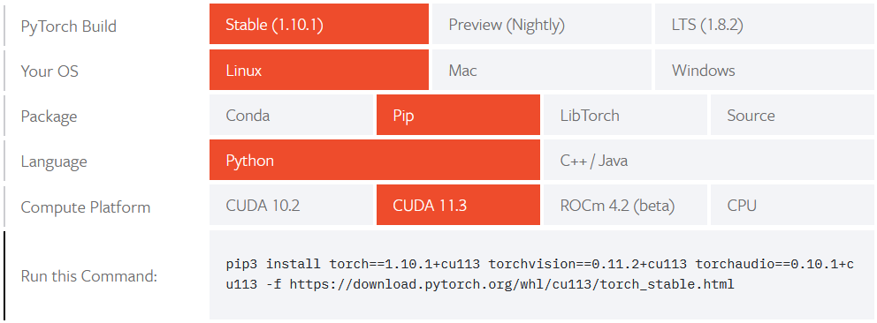

# ARM's Funny Bone

_By Patrick Liu_  
_20 January 2022_

## Introduction

ARM-based computers are more popular than ever with their promise of greater power efficiency over older architectures such as x86.
To that end, many companies today are equipping their devices with ARM-based processors.

However, it isn't entirely without drawbacks. Being a relatively new architecture, there are often difficulties with software compatibilty challenges.
We proposed using a Single-Board Computer (SBC) such as a Jetson Nano or Raspberry Pi as they run a version of Linux. This would in theory simplify
our software development, as we would be able to develop aspects on Windows or Linux (provided the code is written to be cross-platform), and then
bring it all together on the SBC with minimal effort.

In particular, the Jetson Nano was favoured for its Graphics Processor and CUDA cores. These would allow us to accelerate any AI/ML workloads, as
on the Raspberry Pi, they would be run completely on the CPU. Using the CPU is certainly viable, but much slower.

Our system design calls for a Neural Network to perform inference on incoming audio samples, and to that end, we used [PyTorch](https://pytorch.org/),
a popular machine learning framework developed primarily by Facebook's AI Research Lab. Setting up PyTorch on most computers is quite simple. There
are a few different versions of PyTorch that have been pre-built for "common" system architectures, so selecting the correct architecture will provide
the user with a command to install PyTorch. The entire process can be completed in minutes.

## PyTorch on Rare Architectures

The above is not an option with a Raspberry Pi or Jetson Nano -- the commands provided will fail because the Pi and Jetson Nano use ARM-based processors, and
because they have different Instruction Sets (commands that the CPU can run), the pre-built PyTorch versions will simply fail.

Some well-meaning individuals _have_ gone through the (relatively) arduous task of building PyTorch, but these were built for older versions of Python (3.6/3.7).
In order to avoid any compatibility issues with the code we had already written, we decided to build PyTorch ourselves for Python 3.8. The build process
only needs to be done once when we want to update PyTorch (rarely).

Compiling source code is perhaps a surprisingly resource-intensive and time-consuming task that is even a benchmark for computer performance. SBCs are compact,
and one of the areas they tend to sacrifice for this compactness is memory (RAM) capacity. An out-of-memory error is a great and confusing way to have a build fail.
Builds that fail due to running out of memory tend to report obscure errors that don't show up in a Google search.

The typical solution to this is to reduce the number of jobs the compiler runs. For both the Raspberry Pi 4 (4GB RAM) and Jetson Nano (4GB RAM), we set up a swapfile
to "increase" the memory that could be used to build the code. A swapfile in Linux is a file that is treated as a virtual RAM -- objects stored in memory will be
moved to the swapfile as needed, freeing up real memory.

With the swapfile, we found we could run 2 jobs without having memory issues, however, this required some trial and error, and all-in-all, the PyTorch build for the
Jetson Nano took well over a day (24 hours) to complete.

To document the build process, we created a series of instructions in our Git Repository that uses PyTorch: ,
however, to save ourselves time, the compiled versions of PyTorch (one for the Raspberry Pi and Jetson Nano) were uploaded to a shared cloud storage.

## Backups

SBCs like the Jetson Nano and Raspberry Pi tend to use Micro SD cards as their main drives. Micro SD cards are cheap and versatile, but they can be unreliable and
prone to failure.

In the interest of redundancy and quick recovery, we are also creating occasional backups of our SBCs so we can avoid having to go through the lengthy setup processes
in case of SD card failure. If an SD card fails, we can simply copy the most recent backup onto a new SD card and continue using the system as before. Because all
of our code is placed on a Git repository, fetching updated code is also very straightforward.

### Backup Procedure
As we reached a stage where the Raspberry Pi and Jetson Nano both have their prerequisites set up, we decided to make our first backup. The procedure was as follows:

1. Turn off the Raspberry Pi/Jetson Nano and remove the SD card, then connect the SD card to a PC running Linux
2. Unmount the SD card so that no writes are performed to it
3. Use zerofree to set all empty space on the SD card to 0's. This will allow us to compress the backup significantly.
4. Use the `dd` command to clone the SD card and pipe the output to `gzip` for compression.

After mounting the Jetson Nano's SD card to the PC, we can use `sudo fdisk -l` to look at what disks are mounted. In this particular case, the Jetson Nano's SD card
shows up as `/dev/mmcblk0`, with a mount point of `/dev/mmcblk0p1`.

To unmount the partition, the command is: `umount /dev/mmcblk0p1`.

By setting all the empty space on the SD card to 0's, we can significantly compress our backup. Linux's `dd` utility creates an exact bit-for-bit copy of a disk or
partition. As we have large (128 GB) SD cards, this means the backup would be 128 GB, despite being mostly empty space. The command for setting free space to zero's
uses a tool called `zerofree` (available with `sudo apt install zerofree`), and can be called as such: `sudo zerofree -v /dev/mmcblk0p1`. The `-v` switch enables
verbose output.

Finally, we can use `dd` to copy the SD card with:
`dd if=/dev/mmcblk0 bs=1M | gzip > path_to_backup.gz`

The finished backup for the Raspberry Pi was only 16 GB. This is still quite large, but is definitely more reasonable than the 128 GB it would have been without compression.

This backup procedure is somewhat time-consuming (especially as we have large SD cards), so we don't plan to do this often. From here onwards, if we ever need to build
a library from the source code, we will back up the fully-built binaries only. Otherwise, we only plan to do backups when we reach major milestones in the project,
because restoring the software will be relatively simple.

## Lessons Learned

In summary, SBCs offer amazing performance and efficiency and are a great development platform for our project, but they aren't without their quirks.
